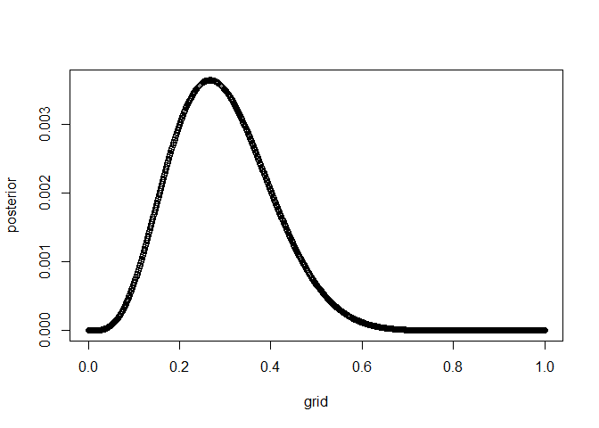
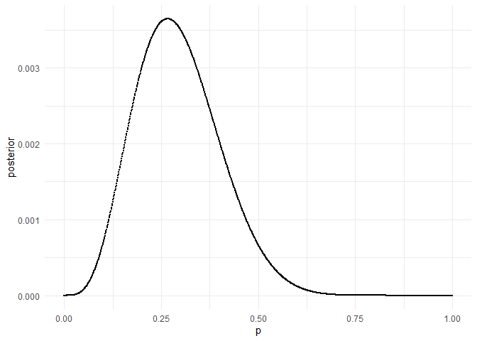
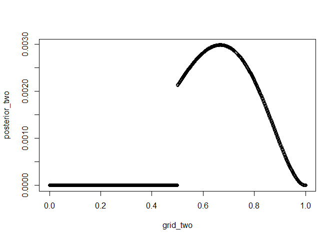
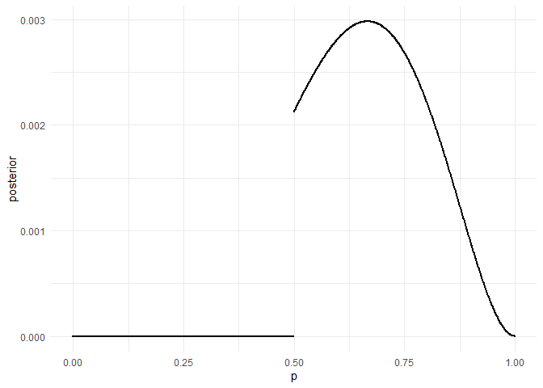
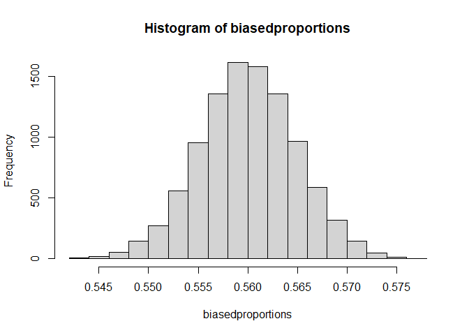

```r
set.seed(06012022)

library(tidyverse)
```

```
## -- Attaching packages --------------------------------------- tidyverse 1.3.0 --
```

```
## v ggplot2 3.3.5     v purrr   0.3.4
## v tibble  3.0.6     v dplyr   1.0.4
## v tidyr   1.1.2     v stringr 1.4.0
## v readr   1.4.0     v forcats 0.5.1
```

```
## Warning: package 'ggplot2' was built under R version 4.0.5
```

```
## -- Conflicts ------------------------------------------ tidyverse_conflicts() --
## x dplyr::filter() masks stats::filter()
## x dplyr::lag()    masks stats::lag()
```


## 1


```r
grid <- seq(from = 0, to = 1, len = 1000)

prior <- 1

likelihood <- dbinom(x = 4, size = 15, prob = grid)

unstd.posterior <- prior * likelihood

posterior <- unstd.posterior / sum(unstd.posterior)

plot(x = grid, y = posterior)
```

<!-- -->


```r
one <- tibble::tibble(
  p = seq(from = 0, to = 1, len = 1000),
  prior = 1,
  likelihood = dbinom(x = 4, size = 15, prob = p),
  unstd.posterior = prior * likelihood,
  posterior = unstd.posterior / sum(unstd.posterior)
)

one %>%
  ggplot(aes(x = p, y = posterior)) +
  geom_point(size = .25) +
  theme_minimal()
```

<!-- -->

## 2


```r
grid <- seq(from = 0, to = 1, len = 1000)

prior <- ifelse(grid < .5, 0, 2)

likelihood <- dbinom(x = 4, size = 6, prob = grid)

unstd.posterior <- prior * likelihood

posterior <- unstd.posterior / sum(unstd.posterior)

plot(x = grid, y = posterior)
```

<!-- -->


```r
two <- tibble::tibble(
  p = seq(from = 0, to = 1, len = 1000),
  prior = case_when(
    p < .5 ~ 0,
    TRUE ~ 2
  ),
  likelihood = dbinom(x = 4, size = 6, prob = p),
  unstd.posterior = prior * likelihood,
  posterior = unstd.posterior / sum(unstd.posterior)
)

two %>%
  ggplot(aes(x = p, y = posterior)) +
  geom_point(size = .25) +
  theme_minimal()
```

<!-- -->

## 3


```r
samples <- sample(
  x = grid,
  size = 1e4,
  replace = TRUE,
  prob = posterior
)

rethinking::PI(samples, prob = .89)
```

```
##        5%       94% 
## 0.5235235 0.8768769
```

```r
rethinking::HPDI(samples, prob = .89)
```

```
##     |0.89     0.89| 
## 0.5005005 0.8378378
```
 
The HPDI is slightly narrower. This is to be expected, since `PI()` chooses the *central* interval with 89% probability, while `HPDI()` finds the *narrowest* interval that contains 89% of the posterior probability.

From the intervals alone, I would likely assume the posterior to be almost symmetrical around them, and would completely miss that no probability at all is assigned to values between 0 and .5. 

## 4


```r
# generate biased binomial sample
biasedrbinom <- function(
                         nsamples = 1e4,
                         # the true proportion of water
                         prob_water = .7,
                         # the proportion of true waters that are flipped to land
                         prob_flip = .2) {
  samples <- tibble(
    real = sample(
      x = c("W", "L"),
      size = nsamples,
      replace = TRUE,
      prob = c(prob_water, 1 - prob_water)
    ),
    biased = case_when(
      real == "W" ~ sample(
        x = c("W", "L"),
        size = nsamples,
        replace = TRUE,
        prob = c(1 - prob_flip, prob_flip)
      ),
      real == "L" ~ "L"
    )
  )

  return(samples)
}

# get the proportion of waters in a biased sample

biasedpropwater <- function() {
  prop <- biasedrbinom() %>%
    summarise(
      propW = sum(biased == "W") / length(biased)
    ) %>%
    pull(propW)

  return(prop)
}
```


```r
biasedproportions <- replicate(n = 1e4, expr = biasedpropwater())

hist(biasedproportions)
```

<!-- -->

The histogram shows that the biased generating process tends to produce proportions of water close to 56%, departing for the true value of 70%. 

Even though I can simulate this I'm not sure how to turn this into a likelihood yet, so not sure how to "analyze" this biased data... I guess it's like a zero-inflated beta model? 
