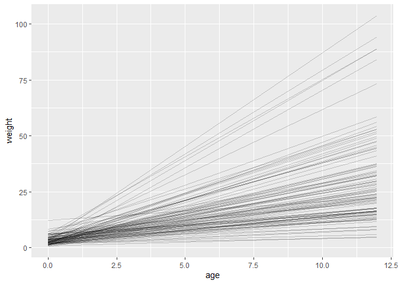

```r
library(rethinking)
library(tidyverse)

set.seed(21012022)

data(Howell1)

d <- Howell1
```

## 1


```r
d1 <- d %>% 
  dplyr::filter(
    age >= 18
  )

mean_height <- mean(d1$height)
sd_height <- sd(d1$height)

mean_weight <- mean(d1$weight)
sd_weight <- sd(d1$weight)

# standardize height and weight
d1_z <- d1 %>% 
  dplyr::mutate(
    across(
      .cols = c("height", "weight"),
      .fns = ~ rethinking::standardize(.x)
    )
  )
```

We will run the following model with `quap`:

$$ \text{weight}_i \sim \operatorname{Normal}(\mu_i, \sigma) $$
$$ \mu_i = \alpha + \beta \text{height}_i$$
$$ \alpha \sim \operatorname{Normal}(0, 1) $$
$$ \beta \sim \operatorname{Log-Normal}(0, 1) $$
$$ \sigma \sim \operatorname{Exponential}(\frac{1}{2}) $$ Let's do some
prior predictive simulation to check that this makes *some* sense.


```r
one_prior_lines <- tibble::tibble(
  n = 1:1e2,
  intercept = rnorm(n = 1e2, mean = 0, sd = 1),
  slope = rlnorm(n = 1e2, mean = 0, sd = 1)
) %>% 
  tidyr::expand(tidyr::nesting(n, intercept, slope), height = range(d1_z$height)) %>% 
  dplyr::mutate(
    weight = intercept + slope * height
  )

one_prior_lines %>% 
  ggplot2::ggplot(ggplot2::aes(x = height, y = weight, group = n)) +
  ggplot2::geom_line(alpha = .2)
```

<!-- -->

This captures the idea that negative relationships are not possible
while still allowing for some absurdly large slopes. Let's also simulate
some data.


```r
one_prior_data <- tibble::tibble(
  height = seq(-3, 3, len = 1e2),
  intercept = rnorm(n = 1e2, mean = 0, sd = 1),
  slope = rlnorm(n = 1e2, mean = 0, sd = 1),
  sigma = rexp(n = 1e2, rate = 1/2)
) %>%
  tidyr::expand(height, tidyr::nesting(intercept, slope, sigma)) %>%
  dplyr::mutate(
    mu = intercept + slope * height,
    weight = rnorm(n = 1e4, mean = mu, sd = sigma)
  )

one_prior_data %>% 
  ggplot2::ggplot(ggplot2::aes(x = height, y = weight)) +
  ggplot2::geom_point(alpha = .3)
```

<!-- -->

Finally, we are ready to run the model.


```r
m1 <- rethinking::quap(
  alist(
    weight ~ dnorm(mu, sigma),
    mu <- a + b*height,
    a ~ dnorm(0, 1),
    b ~ dlnorm(0, 1),
    sigma ~ dexp(1/2)
  ), data = d1_z
)

rethinking::precis(m1)
```

```
##               mean         sd        5.5%      94.5%
## a     1.198682e-07 0.03487854 -0.05574253 0.05574277
## b     7.535859e-01 0.03493894  0.69774669 0.80942503
## sigma 6.547779e-01 0.02466042  0.61536574 0.69418998
```

To make our predictions we can then use the `sim()` function.


```r
heights <- tibble::tibble(
  height = c(140, 160, 175)
)

heights_z <- heights %>% 
  dplyr::mutate(
    height = (height-mean_height)/sd_height
  )

sim.weight <- rethinking::sim(m1, data = heights_z)

weight.PI <- purrr::map_df(
  .x = as.data.frame(sim.weight),
  .f = ~ rethinking::PI(.x),
  prob = .89
)

weight.mean <- purrr::map_dbl(
  .x = as.data.frame(sim.weight),
  .f = ~ mean(.x)
)

dplyr::bind_cols(weight.mean, weight.PI) %>% 
  dplyr::mutate(
    dplyr::across(
      .cols = dplyr::everything(),
      .fns = function(x) x*sd_weight + mean_weight
    )
  ) %>% 
  dplyr::transmute(
    Height = heights$height,
    `Predicted weight` = `...1`,
    `89% Interval` = paste0("[", round(`5%`, 2), ", ", round(`94%`, 2), "]")
  ) %>% knitr::kable()
```

```
## New names:
## * NA -> ...1
```


| Height| Predicted weight|89% Interval   |
|------:|----------------:|:--------------|
|    140|         35.88472|[28.94, 42.44] |
|    160|         48.34184|[41.81, 55.14] |
|    175|         57.85363|[51.24, 64.43] |

## 2


```r
d2 <- d %>% 
  dplyr::filter(
    age < 13
  )
```

For the total causal effect, we simply need to regress weight on age.

Two things are important for the priors: 1. The intercept should be
positive and somewhere around average weight at birth. 2. The slope
should be positive.

I think we can use the Log-Normal trick here again.

For the intercept: [English
Wikipedia](https://en.wikipedia.org/wiki/Birth_weight) tells us that
normal birthweight ranges from 2.5 to 4.5kg. The mean of that is 3.5, so
that should be the mean of our prior for the intercept. Tinkering with
[this online
calculator](https://www.omnicalculator.com/statistics/lognormal-distribution)
tells me that $\operatorname{Log-Normal}(0.75, 1)$ has a mean of 3.49
and a standard deviation of 4.575. I'll stick with that unless
simulation shows it to be absurd.

For the slope, I'll try the same prior as before,
$\operatorname{Log-Norma}(0, 1)$.

And so, our model:

$$ \text{weight}_i \sim \operatorname{Normal}(\mu_i, \sigma) $$
$$ \mu_i = \alpha + \beta \text{age}_i$$
$$ \alpha \sim \operatorname{Log-Normal}(0.75, 1) $$
$$ \beta \sim \operatorname{Log-Normal}(0, 1) $$
$$ \sigma \sim \operatorname{Exponential}(\frac{1}{2}) $$

Let's again simulate many lines to see if this makes sense. Adapting the
code from the previous slide to reflect the new priors and swapping
height for age gives:


```r
two_prior_lines <- tibble::tibble(
  n = 1:1e2,
  intercept = rlnorm(n = 1e2, mean = 0.75, sd = 1),
  slope = rlnorm(n = 1e2, mean = 0, sd = 1)
) %>% 
  tidyr::expand(tidyr::nesting(n, intercept, slope), age = range(d2$age)) %>% 
  dplyr::mutate(
    weight = intercept + slope * age
  )

two_prior_lines %>% 
  ggplot2::ggplot(ggplot2::aes(x = age, y = weight, group = n)) +
  ggplot2::geom_line(alpha = .2)
```

<!-- -->

Ok, this seems a little excessive... Let's try to tighten the prior on
the intercept and slope a little bit.
$\operatorname{Log-Normal}(1.1, 0.5)$ has a mean of 3.40 and a standard
deviation of 1.81, which seems a bit more reasonable. For the slope, the
mean should be around 2: these WHO charts (for
[girls](https://cdn.who.int/media/docs/default-source/child-growth/child-growth-standards/indicators/weight-for-age/cht-wfa-girls-p-0-5.pdf?sfvrsn=d4a8e3bc_12)
and
[boys](https://cdn.who.int/media/docs/default-source/child-growth/child-growth-standards/indicators/weight-for-age/cht-wfa-boys-p-0-5.pdf?sfvrsn=7a899731_12))
make me think that is a reasonable number.
$\operatorname{Log-Normal}(0.5, 0.7)$ has a mean of 2.11 and a standard
deviation of 1.68, so let's try that.

The new model:

$$ \text{weight}_i \sim \operatorname{Normal}(\mu_i, \sigma) $$
$$ \mu_i = \alpha + \beta \text{age}_i$$
$$ \alpha \sim \operatorname{Log-Normal}(1.1, 0.5) $$
$$ \beta \sim \operatorname{Log-Normal}(0.5, 0.7) $$
$$ \sigma \sim \operatorname{Exponential}(\frac{1}{2}) $$

Let's again simulate many lines to see if this makes sense. Adapting the
code from the previous slide to reflect the new priors and swapping
height for age gives:


```r
two_prior_lines2 <- tibble::tibble(
  n = 1:1e2,
  intercept = rlnorm(n = 1e2, mean = 1.1, sd = 0.5),
  slope = rlnorm(n = 1e2, mean = 0.5, sd = 0.7)
) %>% 
  tidyr::expand(tidyr::nesting(n, intercept, slope), age = range(d2$age)) %>% 
  dplyr::mutate(
    weight = intercept + slope * age
  )

two_prior_lines2 %>% 
  ggplot2::ggplot(ggplot2::aes(x = age, y = weight, group = n)) +
  ggplot2::geom_line(alpha = .2)
```

<!-- -->

This seems a lot more reasonable! Let's estimate with `quap`.


```r
m2 <- rethinking::quap(
  alist(
    weight ~ dnorm(mu, sigma),
    mu <- a + b*age,
    a ~ dlnorm(1.1, 0.5),
    b ~ dlnorm(0.5, 0.7),
    sigma ~ dexp(1/2)
  ), data = d2
)

rethinking::precis(m2)
```

```
##           mean         sd     5.5%    94.5%
## a     7.372046 0.36089397 6.795268 7.948825
## b     1.350460 0.05455121 1.263276 1.437643
## sigma 2.513704 0.14620445 2.280041 2.747367
```

Thus, the marginal intercept is higher than I thought, and the marginal
slope is lower than I thought.

Maybe we should plot the data now:


```r
d2 %>% 
  ggplot2::ggplot(ggplot2::aes(x = age, y = weight)) +
  ggplot2::geom_point(alpha = 0.5)
```

<!-- -->

And now for the full plot:


```r
# mu and 89% PI for mu across all ages in the data

age.seq <- tibble::tibble(
  age = seq(0, 12, by = 0.2)
)

mu2 <- rethinking::link(m2, data = age.seq)

mu2.mean <- apply(mu2, 2, mean)
mu2.pi <- apply(mu2, 2, rethinking::PI, prob = 0.89)

mu2.tibble <- age.seq %>% 
  dplyr::mutate(
    mu2.mean = mu2.mean,
    mu2.lower = mu2.pi[1,],
    mu2.upper = mu2.pi[2,]
  )

# simulating weights to calculate 89% prediction interval

sim.weight <- rethinking::sim(m2, data = list(age = age.seq$age))

weight.PI <- apply(sim.weight, 2, rethinking::PI, prob = .89)

pred.tibble <- age.seq %>% 
  dplyr::mutate(
    weight.lower = weight.PI[1,],
    weight.upper = weight.PI[2,],
  )

d2 %>% 
  ggplot2::ggplot(ggplot2::aes(x = age, y = weight)) +
  ggplot2::geom_point(alpha = 0.5) +
  ggplot2::geom_smooth(aes(x = age, y = mu2.mean, ymin = mu2.lower, ymax = mu2.upper), data = mu2.tibble, stat = "identity") +
  ggplot2::geom_ribbon(aes(x = age, y = NULL, ymin = weight.lower, ymax = weight.upper), data = pred.tibble, alpha = .5)
```

<!-- -->

## 3

Now we need to adjust our model to include the interaction with sex. We
can do what Richard did in lecture 4.


```r
d3 <- d2 %>% 
  dplyr::mutate(
    sex = male + 1
  )
```

$$ \text{weight}_i \sim \operatorname{Normal}(\mu_i, \sigma) $$
$$ \mu_i = \alpha_{sex[i]} + \beta_{sex[i]} \text{age}_i$$
$$ \alpha_j \sim \operatorname{Log-Normal}(1.1, 0.5) $$
$$ \beta_j \sim \operatorname{Log-Normal}(0.5, 0.7) $$
$$ \sigma \sim \operatorname{Exponential}(\frac{1}{2}) $$


```r
m3 <- rethinking::quap(
  alist(
    weight ~ dnorm(mu, sigma),
    mu <- a[sex] + b[sex]*age,
    a[sex] ~ dlnorm(1.1, 0.5),
    b[sex] ~ dlnorm(0.5, 0.7),
    sigma ~ dexp(1/2)
  ), data = d3
)

rethinking::precis(m3, depth = 2)
```

```
##           mean         sd     5.5%    94.5%
## a[1]  6.927862 0.47666656 6.166057 7.689668
## a[2]  7.744093 0.50533126 6.936476 8.551710
## b[1]  1.305646 0.07267350 1.189500 1.421792
## b[2]  1.405397 0.07561348 1.284552 1.526241
## sigma 2.414929 0.14060295 2.190219 2.639640
```

This model warns us that it may not have converged. (Edit: It seems that the model does converge with this seed. However, the first time I ran it it did not converge, and had NaN for the values of a[2] and for some values of sigma.)

There seem to be problems estimating the intercept for boys and the
sigma... Perhaps my prior for sigma is not great? Try again.

Our new prior for sigma is the one Richard tends to use throughout the
book:

$$ \sigma \sim \operatorname{Exponential}(1) $$


```r
m3.2 <- rethinking::quap(
  alist(
    weight ~ dnorm(mu, sigma),
    mu <- a[sex] + b[sex]*age,
    a[sex] ~ dlnorm(1.1, 0.5),
    b[sex] ~ dlnorm(0.5, 0.7),
    sigma ~ dexp(1)
  ), data = d3
)

rethinking::precis(m3.2, depth = 2)
```

```
##           mean         sd     5.5%    94.5%
## a[1]  6.929193 0.47471862 6.170501 7.687885
## a[2]  7.745097 0.50326282 6.940786 8.549408
## b[1]  1.305487 0.07237744 1.189814 1.421160
## b[2]  1.405279 0.07530495 1.284927 1.525631
## sigma 2.405074 0.13917678 2.182642 2.627505
```

This works!

------------------------------------------------------------------------

### Exponential interlude

Let's compare the two priors to understand a little better. What I had
tried was $\operatorname{Exponential}(\frac{1}{2})$, which I thought
would be "wider" that his $\operatorname{Exponential}(1)$, since the
mean is supposed to be the inverse of the rate (so the first prior had a
mean of 2, while this second prior has a mean of 1).


```r
data <- tibble::tibble(
  x = c(0, 5)
)

data %>% 
  ggplot2::ggplot(aes(x = x)) +
  stat_function(fun = dexp, args = list(rate = 1), color = "red") +
  stat_function(fun = dexp, args = list(rate = 1/2), color = "blue") 
```

<!-- -->

Ok, so the first prior I had (in blue), is indeed sort of flatter. Is
that what caused problems? Does it assign too much probability to very
high SDs? Let's end this interlude on that question.

------------------------------------------------------------------------

Alrighty, back to our `m3.2`.

Let's see the coefficient plot:


```r
plot(precis(m3.2, depth = 2))
```

<!-- -->

It seems that, after stratifying by sex, the effect of age is similar for boys and girls. But let's actually plot the contrast.


```r
age.seq.2 <- seq(from = 0, to = 13, len = 14)

muF <- link(
  # the model
  m3.2, 
  data = list(
    # just 14 girls
    sex = rep(1, 14),
    # one of each age
    age = age.seq.2
  )
)

muM <- link(
  # the model
  m3.2, 
  data = list(
    # just 14 boys
    sex = rep(2, 14),
    # one of each age
    age = age.seq.2
  )
)

mu_contrast <- muF - muM

plot(NULL, xlim = range(age.seq.2), ylim = c(-5,2), xlab = "age (years)", ylab = "weight contrast (F-M)")
for (p in c(.5, .6, .7, .8, .9, .99))
  shade(apply(mu_contrast, 2, rethinking::PI, prob = p), age.seq.2)
abline(h = 0, lty =2)
```

<!-- -->

It looks like, at every age, but especially as age increases, girls weigh, on average, less than boys.

However, if I want to see the contrast in *slope*, shouldn't I draw samples from the posterior and then subtract b[2] from b[1]?


```r
m3.2.post <- rethinking::extract.samples(m3.2)

slope.contrast <- m3.2.post$b[,1] - m3.2.post$b[,2]

dens(slope.contrast)
```

<!-- -->

```r
mean(slope.contrast)
```

```
## [1] -0.1013534
```

```r
rethinking::PI(slope.contrast, prob = 0.89)
```

```
##         5%        94% 
## -0.2700159  0.0672791
```

I think this means we think that girls grow a little slower than boys as they age from 0 to 12. However, there is still some probability that girls grow faster. 


```r
sum(slope.contrast > 0)/length(slope.contrast)
```

```
## [1] 0.1715
```

Indeed, 16% probability that the slope is higher for girls than boys.
