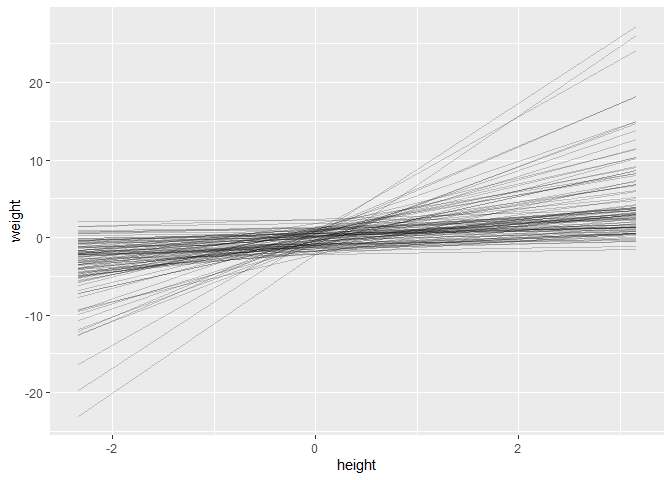
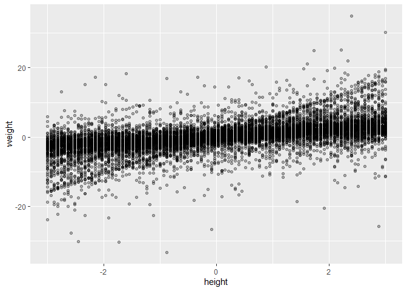

```r
library(rethinking)
```

```
## Loading required package: rstan
```

```
## Loading required package: StanHeaders
```

```
## Loading required package: ggplot2
```

```
## Warning: package 'ggplot2' was built under R version 4.0.5
```

```
## rstan (Version 2.21.2, GitRev: 2e1f913d3ca3)
```

```
## For execution on a local, multicore CPU with excess RAM we recommend calling
## options(mc.cores = parallel::detectCores()).
## To avoid recompilation of unchanged Stan programs, we recommend calling
## rstan_options(auto_write = TRUE)
```

```
## Do not specify '-march=native' in 'LOCAL_CPPFLAGS' or a Makevars file
```

```
## Loading required package: parallel
```

```
## rethinking (Version 2.13)
```

```
## 
## Attaching package: 'rethinking'
```

```
## The following object is masked from 'package:stats':
## 
##     rstudent
```

```r
library(tidyverse)
```

```
## -- Attaching packages --------------------------------------- tidyverse 1.3.0 --
```

```
## v tibble  3.0.6     v dplyr   1.0.4
## v tidyr   1.1.2     v stringr 1.4.0
## v readr   1.4.0     v forcats 0.5.1
## v purrr   0.3.4
```

```
## -- Conflicts ------------------------------------------ tidyverse_conflicts() --
## x tidyr::extract() masks rstan::extract()
## x dplyr::filter()  masks stats::filter()
## x dplyr::lag()     masks stats::lag()
## x purrr::map()     masks rethinking::map()
```

```r
data(Howell1)

d <- Howell1
```


## 1

```r
d1 <- d %>% 
  dplyr::filter(
    age >= 18
  )

mean_height <- mean(d1$height)
sd_height <- sd(d1$height)

mean_weight <- mean(d1$weight)
sd_weight <- sd(d1$weight)

# standardize height and weight
d1_z <- d1 %>% 
  dplyr::mutate(
    across(
      .cols = c("height", "weight"),
      .fns = ~ rethinking::standardize(.x)
    )
  )
```

We will run the following model with `quap`:

$$ \text{weight}_i \sim \operatorname{Normal}(\mu_i, \sigma) $$
$$ \mu_i = \alpha + \beta \text{height}_i$$
$$ \alpha \sim \operatorname{Normal}(0, 1) $$
$$ \beta \sim \operatorname{Log-Normal}(0, 1) $$
$$ \sigma \sim \operatorname{Exponential}(\frac{1}{2}) $$
Let's do some prior predictive simulation to check that this makes *some* sense.


```r
one_prior_lines <- tibble::tibble(
  n = 1:1e2,
  intercept = rnorm(n = 1e2, mean = 0, sd = 1),
  slope = rlnorm(n = 1e2, mean = 0, sd = 1)
) %>% 
  tidyr::expand(tidyr::nesting(n, intercept, slope), height = range(d1_z$height)) %>% 
  dplyr::mutate(
    weight = intercept + slope * height
  )

one_prior_lines %>% 
  ggplot2::ggplot(ggplot2::aes(x = height, y = weight, group = n)) +
  ggplot2::geom_line(alpha = .2)
```

<!-- -->

This captures the idea that negative relationships are not possible while still allowing for some absurdly large slopes. Let's also simulate some data.


```r
one_prior_data <- tibble::tibble(
  height = seq(-3, 3, len = 1e2),
  intercept = rnorm(n = 1e2, mean = 0, sd = 1),
  slope = rlnorm(n = 1e2, mean = 0, sd = 1),
  sigma = rexp(n = 1e2, rate = 1/2)
) %>%
  tidyr::expand(height, tidyr::nesting(intercept, slope, sigma)) %>%
  dplyr::mutate(
    mu = intercept + slope * height,
    weight = rnorm(n = 1e4, mean = mu, sd = sigma)
  )

one_prior_data %>% 
  ggplot2::ggplot(ggplot2::aes(x = height, y = weight)) +
  ggplot2::geom_point(alpha = .3)
```

<!-- -->

Finally, we are ready to run the model.


```r
m1 <- rethinking::quap(
  alist(
    weight ~ dnorm(mu, sigma),
    mu <- a + b*height,
    a ~ dnorm(0, 1),
    b ~ dlnorm(0, 1),
    sigma ~ dexp(1/2)
  ), data = d1_z
)

rethinking::precis(m1)
```

```
##               mean         sd        5.5%      94.5%
## a     3.054726e-08 0.03487867 -0.05574282 0.05574288
## b     7.535855e-01 0.03493907  0.69774613 0.80942488
## sigma 6.547803e-01 0.02466065  0.61536779 0.69419275
```

To make our predictions we can then use the `sim()` function.


```r
heights <- tibble::tibble(
  height = c(140, 160, 175)
)

heights_z <- heights %>% 
  dplyr::mutate(
    height = (height-mean_height)/sd_height
  )

sim.weight <- rethinking::sim(m1, data = heights_z)

weight.PI <- purrr::map_df(
  .x = as.data.frame(sim.weight),
  .f = ~ rethinking::PI(.x),
  prob = .89
)

weight.mean <- purrr::map_dbl(
  .x = as.data.frame(sim.weight),
  .f = ~ mean(.x)
)

dplyr::bind_cols(weight.mean, weight.PI) %>% 
  dplyr::mutate(
    dplyr::across(
      .cols = dplyr::everything(),
      .fns = function(x) x*sd_weight + mean_weight
    )
  ) %>% 
  dplyr::transmute(
    Height = heights$height,
    `Predicted weight` = `...1`,
    `89% Interval` = paste0("[", round(`5%`, 2), ", ", round(`94%`, 2), "]")
  ) %>% knitr::kable()
```

```
## New names:
## * NA -> ...1
```


| Height| Predicted weight|89% Interval   |
|------:|----------------:|:--------------|
|    140|         35.63898|[28.84, 42.38] |
|    160|         48.34872|[41.88, 54.81] |
|    175|         57.91829|[51.45, 64.84] |

