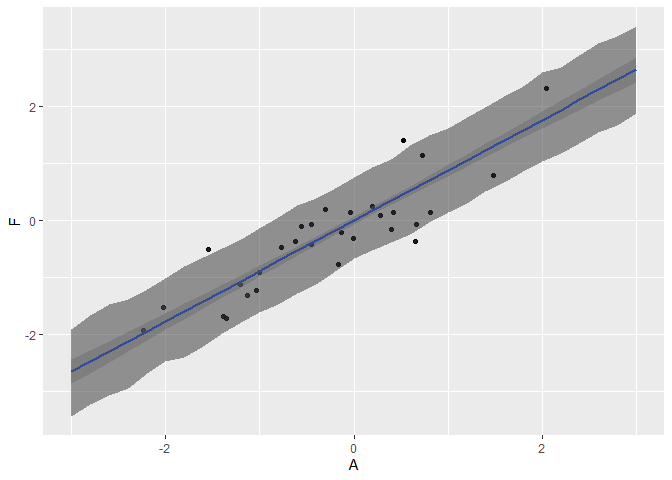
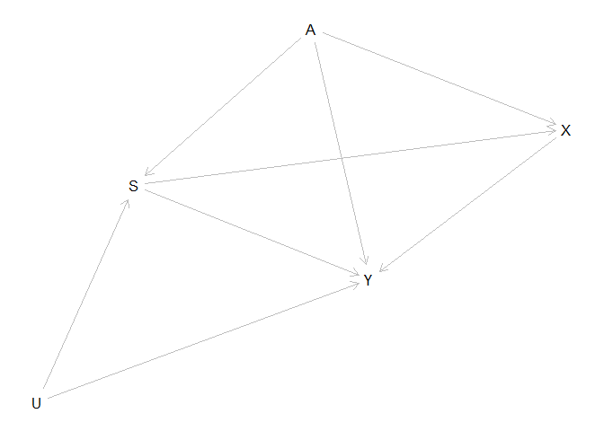

```r
library(rethinking)
library(tidyverse)

set.seed(22012022)

data(foxes)

d <- foxes
```

## 1


```r
d1 <- d %>% 
  dplyr::mutate(
    A = rethinking::standardize(area),
    F = rethinking::standardize(avgfood)
  )
```

Since there is no back-door at all, we can simply regress Food on Area to get the total (and, in this case, also direct) causal effect of A on F. 

$$ \text{F}_i \sim \operatorname{Normal}(\mu_i, \sigma) $$
$$ \mu_i = \alpha + \beta\text{A}_i $$
$$ \alpha \sim \operatorname{Normal}(0, 0.2) $$
$$ \beta \sim \operatorname{Normal}(0, 1) $$
$$ \sigma \sim \operatorname{Exponential}(1) $$


```r
m1 <- rethinking::quap(
  alist(
    F ~ dnorm(mu, sigma),
    mu <- a + b*A,
    a ~ dnorm(0, 0.2),
    b ~ dnorm(0, 1),
    sigma ~ dexp(1)
  ), 
  data = d1
)

precis(m1)
```

```
##               mean         sd        5.5%      94.5%
## a     7.843048e-08 0.04230780 -0.06761596 0.06761611
## b     8.814382e-01 0.04343473  0.81202108 0.95085526
## sigma 4.662197e-01 0.03051689  0.41744782 0.51499160
```

From the marginal distribution of $\beta$, we conclude that each standard deviation increase in Area increases Food by .88 SD.

For a plot of the whole thing:


```r
# mu and 89% PI for mu across all areas in the data

area.seq <- tibble::tibble(
  A = seq(-3, 3, by = 0.2)
)

mu1 <- rethinking::link(m1, data = area.seq)

mu1.mean <- apply(mu1, 2, mean)
mu1.pi <- apply(mu1, 2, rethinking::PI, prob = 0.89)

mu1.tibble <- area.seq %>% 
  dplyr::mutate(
    mu1.mean = mu1.mean,
    mu1.lower = mu1.pi[1,],
    mu1.upper = mu1.pi[2,]
  )

# simulating weights to calculate 89% prediction interval

sim.weight <- rethinking::sim(m1, data = list(A = area.seq$A))

weight.PI <- apply(sim.weight, 2, rethinking::PI, prob = .89)

pred.tibble <- area.seq %>% 
  dplyr::mutate(
    weight.lower = weight.PI[1,],
    weight.upper = weight.PI[2,],
  )

d1 %>% 
  ggplot2::ggplot(ggplot2::aes(x = A, y = F)) +
  ggplot2::geom_point(alpha = 0.5) +
  ggplot2::geom_smooth(aes(x = A, y = mu1.mean, ymin = mu1.lower, ymax = mu1.upper), data = mu1.tibble, stat = "identity") +
  ggplot2::geom_ribbon(aes(x = A, y = NULL, ymin = weight.lower, ymax = weight.upper), data = pred.tibble, alpha = .5)
```

<!-- -->

## 2


```r
d2 <- d %>% 
  dplyr::mutate(
    A = rethinking::standardize(area),
    F = rethinking::standardize(avgfood),
    W = rethinking::standardize(weight),
    G = rethinking::standardize(groupsize)
  )
```

For the total causal effect, we can simply regress weight on food.

$$ \text{W}_i \sim \operatorname{Normal}(\mu_i, \sigma) $$
$$ \mu_i = \alpha + \beta\text{F}_i $$
$$ \alpha \sim \operatorname{Normal}(0, 0.2) $$
$$ \beta \sim \operatorname{Normal}(0, 1) $$
$$ \sigma \sim \operatorname{Exponential}(1) $$


```r
m2 <- rethinking::quap(
  alist(
    W ~ dnorm(mu, sigma),
    mu <- a + b*F,
    a ~ dnorm(0, 0.2),
    b ~ dnorm(0, 1),
    sigma ~ dexp(1)
  ), 
  data = d2
)

precis(m2)
```

```
##                mean         sd       5.5%     94.5%
## a     -1.027080e-06 0.08360010 -0.1336101 0.1336081
## b     -2.482821e-02 0.09203231 -0.1719136 0.1222572
## sigma  9.911429e-01 0.06465840  0.8878063 1.0944795
```

Somehow adding food seems to have a rather small effect on the weight of the foxes.

I would speculate that more food leads to larger groups so that each individual fox ends up eating about the same anyway.

Let's check the direct effect of food on weight by adding groupsize as a predictor.

$$ \text{W}_i \sim \operatorname{Normal}(\mu_i, \sigma) $$
$$ \mu_i = \alpha + \beta_F\text{F}_i + \beta_G\text{G}_i $$
$$ \alpha \sim \operatorname{Normal}(0, 0.2) $$
$$ \beta_j \sim \operatorname{Normal}(0, 1) $$
$$ \sigma \sim \operatorname{Exponential}(1) $$


```r
m2.2 <- rethinking::quap(
  alist(
    W ~ dnorm(mu, sigma),
    mu <- a + bF*F + bG*G,
    a ~ dnorm(0, 0.2),
    bF ~ dnorm(0, 1),
    bG ~ dnorm(0, 1),
    sigma ~ dexp(1)
  ), 
  data = d2
)

precis(m2.2)
```

```
##                mean         sd       5.5%      94.5%
## a     -9.951017e-06 0.07995525 -0.1277939  0.1277740
## bF     5.916044e-01 0.19540629  0.2793074  0.9039014
## bG    -6.890407e-01 0.19540789 -1.0013403 -0.3767412
## sigma  9.394854e-01 0.06133642  0.8414580  1.0375129
```

Indeed, for each level of groupsize, more food seems to imply more weight. And symmetrically, once we know the amount of food, higher group sizes are indicative of lower individual weight. 

Our DAG suggests that food comes "first", meaning that the story we associate with both models is that higher food leads directly to higher weight, but it also leads to larger groups. Since more individuals then all share the same food, that has a negative effect on the weight, balancing out. Perhaps groups of foxes grow in a sort of equilibrium, where they become more numerous if food allows but only as long as each individual maintains a minimum level of weight.

But that's for urban ecologists to theorize. 

## 3

Let's try doing this by hand first, and then confirm with `daggity`. First, numbering and commenting on all the paths:

1. $X \rightarrow Y$: this is the target of our inference, and not a backdoor path. But it's worth remembering.
2. $X \leftarrow S \rightarrow Y$: Here S is a fork, and can induce spurious associations between X and Y. We probably want to **adjust for S**.
3. $X \leftarrow S \leftarrow U \rightarrow Y$: Here U is a fork. We cannot adjust for it, but adjusting for S fixes this problem anyway.
4. $X \leftarrow S \leftarrow A \rightarrow Y$: Here A is a fork, but the path is already blocked if we adjust for S.
5. $X \leftarrow A \rightarrow Y$: A again is a fork, and this path is wide open, so we should **adjust for A**.
6. $X \leftarrow A \rightarrow S \rightarrow Y$: Again A being a sneaky fork. Taken care of already, though!
7. $X \leftarrow A \rightarrow S \leftarrow U \rightarrow Y$: Phew! This path would normally be closed, since S is a collider. We are adjusting for S, though, so we opened up the path, making A a fork again. Luckily, adjusting for A will fix this.

So, our adjustment set: $\mathbb{S} = \{A, S\}$. 

Does daggity agree?


```r
dag <- dagitty::dagitty('dag {
                        A -> S <- U -> Y
                        A -> X <- S -> Y
                        X -> Y
                        A -> Y
}' )

plot(dag)
```

```
## Plot coordinates for graph not supplied! Generating coordinates, see ?coordinates for how to set your own.
```

<!-- -->

```r
dagitty::adjustmentSets(
  x = dag,
  exposure = "X",
  outcome = "Y"
)
```

```
## { A, S }
```

We have agreement!

Now, if we regressed Y on X, S, and A, what would we be calculating?

1. For X, we would be calculating its **total effect**, since we successfully blocked all backdoor paths.
2. For S, we would be estimating its **direct effect**. Unfortunately, this would be confounded by U, since we did not block the fork $S \leftarrow U \rightarrow Y$.
3. For A, we would be estimating its **direct effect**. While adjusting for X and S closes all frontdoor paths, we also open up the path through S as a collider ($A \rightarrow S \leftarrow U \rightarrow Y$), so this estimate would also be confounded...


