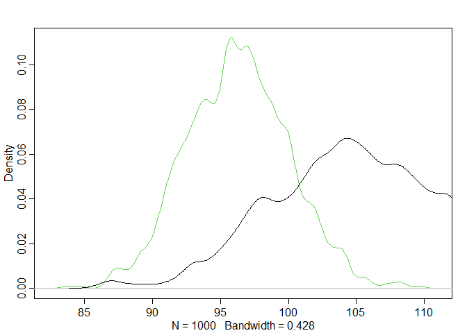

```r
library(rethinking)
library(tidyverse)

set.seed(29012022)
```

## 1


```r
d <- sim_happiness(seed = 1977, N_years = 1000)

d2 <- d[d$age > 17, ]

d2$A <- (d2$age-18) / (65 -18)

d2$mid <- d2$married + 1
```


```r
m6.9 <- ulam(
  alist(
    happiness ~ dnorm(mu, sigma),
    mu <- a[mid] + bA*A,
    a[mid] ~ dnorm(0, 1),
    bA ~ dnorm(0, 2),
    sigma ~ dexp(1)
  ), data = d2, chains = 4, cores = 4, log_lik = TRUE
)

m6.10 <- ulam(
  alist(
    happiness ~ dnorm(mu, sigma),
    mu <- a + bA*A,
    a ~ dnorm(0, 1),
    bA ~ dnorm(0, 2),
    sigma ~ dexp(1)
  ), data = d2, chains = 4, cores = 4, log_lik = TRUE
)


# m6.9 <- quap(
#   alist(
#     happiness ~ dnorm(mu, sigma),
#     mu <- a[mid] + bA*A,
#     a[mid] ~ dnorm(0, 1),
#     bA ~ dnorm(0, 2),
#     sigma ~ dexp(1)
#   ), data = d2
# )
# 
# m6.10 <- quap(
#   alist(
#     happiness ~ dnorm(mu, sigma),
#     mu <- a + bA*A,
#     a ~ dnorm(0, 1),
#     bA ~ dnorm(0, 2),
#     sigma ~ dexp(1)
#   ), data = d2
# )
```


```r
precis(m6.9, depth = 2)
```

```
##             mean         sd       5.5%      94.5%    n_eff    Rhat4
## a[1]  -0.2318243 0.06272629 -0.3315308 -0.1306235 880.4940 1.000500
## a[2]   1.2615278 0.08387418  1.1277405  1.3946208 811.6500 1.001111
## bA    -0.7549226 0.11119615 -0.9367168 -0.5849666 747.5442 1.000865
## sigma  0.9934840 0.02255824  0.9575082  1.0296554 933.9971 1.000479
```

```r
precis(m6.10)
```

```
##               mean         sd       5.5%     94.5%     n_eff    Rhat4
## a      0.001978197 0.07767627 -0.1230103 0.1267577  463.7600 1.002031
## bA    -0.005665350 0.13410126 -0.2242740 0.2047037  493.5203 1.000021
## sigma  1.214659976 0.02702281  1.1731313 1.2588202 1272.5884 1.003078
```


```r
compare(m6.9, m6.10)
```

```
##           WAIC       SE    dWAIC      dSE    pWAIC       weight
## m6.9  2713.532 37.20768   0.0000       NA 3.506169 1.000000e+00
## m6.10 3101.828 27.68082 388.2962 35.11766 2.318134 4.814407e-85
```

```r
compare(m6.9, m6.10, func = PSIS)
```

```
##           PSIS       SE    dPSIS      dSE    pPSIS       weight
## m6.9  2713.551 37.22800   0.0000       NA 3.515802 1.000000e+00
## m6.10 3101.841 27.69561 388.2901 35.11846 2.324680 4.829289e-85
```

Both indicators prefer model m6.9, which predicts happiness by age while stratifying for marriage status.

Assuming the simple DAG in the book, $H \rightarrow M \leftarrow A$, we are capturing a non-causal association between age and happiness, brought about by conditioning on collider M. Still, we can interpret the coefficients as follows: Once we know someone's marital status, knowing their age helps us to predict their happiness more accurately. Symmetrically, if we already know someone's age, learning their marital status helps us to better predict their happiness.

## 2


```r
data("foxes")

d2 <- foxes %>% 
  dplyr::mutate(
    A = rethinking::standardize(area),
    F = rethinking::standardize(avgfood),
    W = rethinking::standardize(weight),
    G = rethinking::standardize(groupsize)
  )
```

To solve this exercise, we first run the same models as last week, and include one with just the interaction of food and group size for fun.


```r
# weight on food
m1 <- rethinking::quap(
  alist(
    W ~ dnorm(mu, sigma),
    mu <- a + b*F,
    a ~ dnorm(0, 0.2),
    b ~ dnorm(0, 1),
    sigma ~ dexp(1)
  ), 
  data = d2
)

# weight on food and groupsize
m2 <- rethinking::quap(
  alist(
    W ~ dnorm(mu, sigma),
    mu <- a + bF*F + bG*G,
    a ~ dnorm(0, 0.2),
    bF ~ dnorm(0, 1),
    bG ~ dnorm(0, 1),
    sigma ~ dexp(1)
  ), 
  data = d2
)

# weight on interaction food by groupsize
m3 <- rethinking::quap(
  alist(
    W ~ dnorm(mu, sigma),
    mu <- a + bFG*F*G,
    a ~ dnorm(0, 0.2),
    bFG ~ dnorm(0, 1),
    sigma ~ dexp(1)
  ), 
  data = d2
)
```


```r
precis(m1)
```

```
##                mean         sd       5.5%     94.5%
## a      3.725909e-09 0.08360015 -0.1336092 0.1336092
## b     -2.482684e-02 0.09203238 -0.1719124 0.1222587
## sigma  9.911437e-01 0.06465853  0.8878069 1.0944805
```

```r
precis(m2)
```

```
##                mean         sd       5.5%      94.5%
## a      0.0001335096 0.07996167 -0.1276607  0.1279277
## bF     0.5913048925 0.19542481  0.2789783  0.9036315
## bG    -0.6887858198 0.19542624 -1.0011147 -0.3764569
## sigma  0.9395752509 0.06135111  0.8415243  1.0376262
```

```r
precis(m3)
```

```
##              mean         sd        5.5%       94.5%
## a      0.06727318 0.09437404 -0.08355477 0.218101123
## bFG   -0.09071076 0.06078557 -0.18785785 0.006436327
## sigma  0.98171757 0.06406641  0.87932706 1.084108066
```


```r
compare(m1, m2, m3)
```

```
##        WAIC       SE     dWAIC      dSE    pWAIC     weight
## m2 323.3472 16.54921  0.000000       NA 3.774553 0.97185147
## m3 330.8922 13.99651  7.544974 7.217601 2.125376 0.02234753
## m1 333.5896 13.90595 10.242345 7.811940 2.479261 0.00580100
```

```r
compare(m1, m2, m3, func = PSIS)
```

```
## Some Pareto k values are high (>0.5). Set pointwise=TRUE to inspect individual points.
```

```
##        PSIS       SE    dPSIS      dSE    pPSIS     weight
## m2 323.7271 16.63543 0.000000       NA 3.988845 0.96617308
## m3 330.9739 13.95337 7.246848 7.335632 2.164211 0.02578826
## m1 333.3052 13.88455 9.578161 7.914612 2.363507 0.00803866
```

Both time, m2 wins - but barely. In that model, bF is the direct effect of food on weight, while bG is the total effect of groupsize on weight (because we controlled for confounder F).

# 3


```r
data("cherry_blossoms")

d3.0 <- cherry_blossoms %>% 
  filter(
    complete.cases(doy, temp)
  ) 

d3 <- d3.0 %>%  
  mutate(
    across(
      .cols = -year,
      .fns = ~rethinking::standardize(.x)
    )
  ) 
```


```r
m3.1 <- rethinking::quap(
  alist(
    doy ~ dnorm(mu, sigma),
    mu <- a + b*temp,
    a ~ dnorm(0, 0.2),
    b ~ dnorm(0, 1),
    sigma ~ dexp(1)
  ), data = d3
)

m3.2 <- rethinking::quap(
  alist(
    doy ~ dstudent(2,mu,sigma),
    mu <- a + b*temp,
    a ~ dnorm(0, 0.2),
    b ~ dnorm(0, 1),
    sigma ~ dexp(1)
  ), data = d3
)

m3.3 <- rethinking::quap(
  alist(
    doy ~ dnorm(mu,sigma),
    mu <- a + b*temp,
    sigma <- as + b2*temp,
    a ~ dnorm(0, 0.2),
    as ~ dexp(1),
    b ~ dnorm(0, 1),
    b2 ~ dnorm(0, 0.2)
  ), data = d3
)
```


```r
compare(m3.1, m3.2, m3.3)
```

```
##          WAIC       SE      dWAIC       dSE    pWAIC       weight
## m3.3 2142.313 41.19960   0.000000        NA 4.249119 9.699274e-01
## m3.1 2149.260 40.86500   6.947214  6.707792 2.836441 3.007260e-02
## m3.2 2250.370 43.47771 108.057700 14.829554 2.722409 3.328954e-24
```

```r
compare(m3.1, m3.2, m3.3, func = PSIS)
```

```
## Some Pareto k values are high (>0.5). Set pointwise=TRUE to inspect individual points.
```

```
##          PSIS       SE      dPSIS       dSE    pPSIS       weight
## m3.3 2142.328 41.16856   0.000000        NA 4.239462 9.712446e-01
## m3.1 2149.368 40.82231   7.039508  6.832861 2.889315 2.875536e-02
## m3.2 2250.554 43.49565 108.225512 14.859962 2.827712 3.065189e-24
```

The thirds model wins both times. In this model, we modeled the mu of doy as a linear function of temperature, and we also modeled the sigma as a linear function of temperature, which seems to provide an edge in out of sample prediction. So we will use samples from this posterior to predict the doy if march temperature reached 9 degrees. 

First, we need to turn 9 degrees into a z-score.


```r
meantemp <- mean(d3.0$temp)
meandoy <- mean(d3.0$doy)

sdtemp <- sd(d3.0$temp)
sddoy <- sd(d3.0$doy)

z9 <- (9-meantemp)/sdtemp
```


```r
simdoy <- rethinking::sim(m3.3, data = list(temp = z9))

# unstandardize please

pred.doy <- simdoy*sddoy + meandoy

dens(pred.doy, col = 3)

#to compare with observed data

dens(d3.0$doy, add = TRUE)
```

<!-- -->

We see that our model predicts both a much earlier blossom as well as a tighter density (because it expects SD to shrink as temperatures rise).

Cool! My first time modeling SD :D


