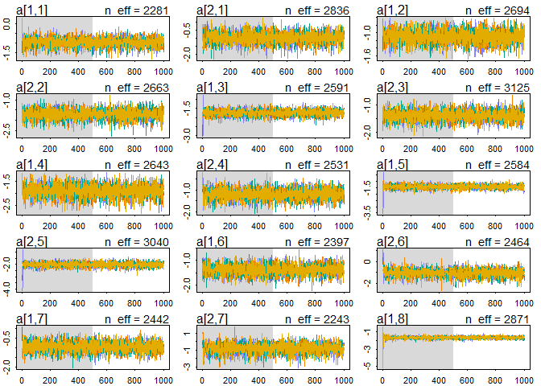

```r
library(rethinking)
library(tidyverse)
library(dagitty)

set.seed(19022022)
```

## 1


```r
data("NWOGrants")

d1 <- NWOGrants %>%
  dplyr::mutate(
    gender = dplyr::case_when(
      gender == "m" ~ 1,
      gender == "f" ~ 2
    )
  )
```

Our DAG for this situation:


```r
dag1 <- dagitty::dagitty("dag{
  gender -> discipline;
  gender -> awards;
  discipline -> awards
}")

plot(dag1)
```

```
## Plot coordinates for graph not supplied! Generating coordinates, see ?coordinates for how to set your own.
```

<!-- -->

To estimate the total effect of gender, we really only need to include gender as a predictor. 


```r
m1 <- rethinking::ulam(
  alist(
    awards ~ binomial(applications, p),
    logit(p) <- a[gender],
    a[gender] ~ normal(0, 1)
  ),
  data = d1, chains = 4, cores = 4
)
```

Now to check the model:


```r
precis(m1, depth = 2)
```

```
##           mean         sd      5.5%     94.5%    n_eff    Rhat4
## a[1] -1.529979 0.06431778 -1.630194 -1.424371 1279.328 1.001215
## a[2] -1.732107 0.08186091 -1.869603 -1.599337 1513.866 1.000310
```

This looks OK. In total, it looks like female applicants are at a slight disadvantage, but we best confirm that later by computing the comparison itself. First, some more diagnostics:


```r
traceplot(m1)
```

```
## [1] 1000
## [1] 1
## [1] 1000
```

```r
trankplot(m1)
```

<!-- --><!-- -->

Wonderful!

To the contrast.


```r
m1_post <- rethinking::extract.samples(m1)

m1_probs <- tibble(
  p_male = rethinking::inv_logit(m1_post$a[, 1]),
  p_female = rethinking::inv_logit(m1_post$a[, 2]),
  diff_male_female = p_male - p_female
)

m1_probs %>%
  ggplot(aes(x = diff_male_female)) +
  geom_density()
```

<!-- -->

It seems for this data set, too, males are at some advantage - around 3 percentage points.

## 2 


```r
d2 <- d1 %>%
  mutate(
    discipline = as.integer(discipline)
  )
```

For the direct effect of gender, we'll need to include departments in the analysis and then marginalize over them.


```r
m2 <- rethinking::ulam(
  alist(
    awards ~ binomial(applications, p),
    logit(p) <- a[gender, discipline],
    matrix[gender, discipline]:a ~ normal(0, 1)
  ),
  data = d2, chains = 4, cores = 4
)
```

First, a summary:


```r
precis(m2, depth = 3)
```

```
##              mean        sd      5.5%      94.5%    n_eff     Rhat4
## a[1,1] -0.9819852 0.2397224 -1.359463 -0.6156509 2280.813 0.9986351
## a[1,2] -1.1063782 0.1824638 -1.403888 -0.8296269 2693.612 0.9983442
## a[1,3] -1.7339073 0.1758266 -2.023526 -1.4604574 2590.544 1.0002260
## a[1,4] -1.9111264 0.2652717 -2.344890 -1.5034208 2642.954 0.9991742
## a[1,5] -1.4373704 0.1604179 -1.697688 -1.1852729 2583.725 0.9995061
## a[1,6] -1.3817140 0.2120739 -1.721496 -1.0480219 2397.124 0.9996212
## a[1,7] -0.9516348 0.2708526 -1.384916 -0.5268861 2442.041 1.0000832
## a[1,8] -1.6839762 0.1321425 -1.908943 -1.4808144 2870.781 0.9984950
## a[1,9] -1.6227215 0.1957846 -1.925627 -1.3163456 2830.691 0.9993779
## a[2,1] -0.9703328 0.3481185 -1.541829 -0.4276123 2836.163 0.9988678
## a[2,2] -1.7089276 0.2520219 -2.129578 -1.3342542 2663.458 0.9986061
## a[2,3] -1.3893174 0.1949933 -1.694163 -1.0818392 3125.147 0.9992947
## a[2,4] -1.1950504 0.2541944 -1.607479 -0.7993552 2530.698 0.9988512
## a[2,5] -2.0110758 0.1930420 -2.326869 -1.7078610 3039.598 0.9993476
## a[2,6] -1.0879876 0.3742567 -1.693201 -0.5122020 2464.322 0.9994279
## a[2,7] -0.8489329 0.5920023 -1.799062  0.0722852 2243.239 1.0001002
## a[2,8] -2.0039197 0.1510253 -2.251302 -1.7770179 2382.243 0.9990712
## a[2,9] -1.2349801 0.2804270 -1.693600 -0.7986020 2564.351 0.9998193
```

N_effs and rhats are good. Further diagnostics:


```r
traceplot(m2)
```

```
## [1] 1000
## [1] 1
## [1] 1000
```

```
## Waiting to draw page 2 of 2
```

<!-- -->

```r
trankplot(m2)
```

<!-- -->

```
## Waiting to draw page 2 of 2
```

<!-- --><!-- -->

Looking pretty good!

Now, to marginalize, following Richard's code. 


```r
# we want to simulate as many apps as there were in the data

n_apps <- sum(d2$applications)

# we also want each department to have as many app as in the data

# apps_per_dept <- sapply(1:6, function (i) sum(d2$applications[d2$discipline==i]))

# can I do it in tidyverse?? i can! is it more pretty though??

apps_per_dept <- purrr::map_dbl(
  .x = 1:9,
  .f = ~ filter(d2, discipline == .x) %>%
    pull(applications) %>%
    sum()
)

# let's get results just for men

p_male <- link(m2, data = list(
  discipline = rep(1:9, times = apps_per_dept),
  applications = rep(1, n_apps),
  gender = rep(1, n_apps)
))

p_female <- link(m2, data = list(
  discipline = rep(1:9, times = apps_per_dept),
  applications = rep(1, n_apps),
  gender = rep(2, n_apps)
))

dens(p_male - p_female)
```

<!-- -->

Now it looks like, on average, the direct effect is close to zero, although the distribution is clearly bimodal, with one mode benefitting men and another benefitting women slightly...

## 3

This pattern shows how self-selection (influenced by gender!) onto departments with differing admissions rates can create a picture of gender bias in one direction in the aggregate, all while each department can have their own level of gender bias in any direction.
