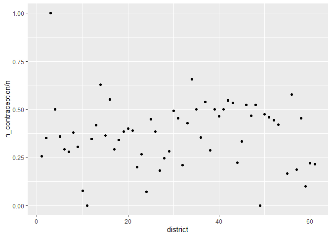
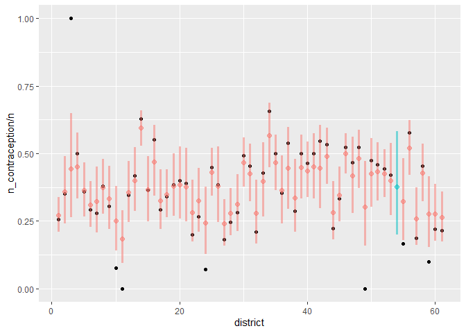
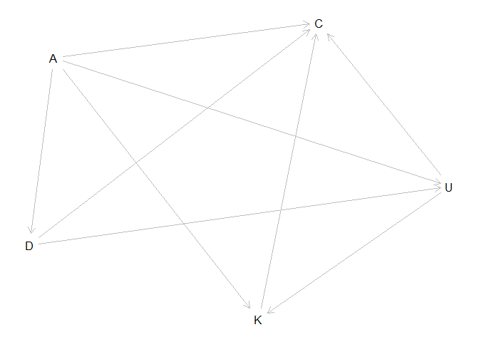

```r
library(rethinking)
library(tidybayes)
library(tidyverse)
library(dagitty)


set.seed(24032022)
```

## 1


```r
data(bangladesh)

d <- bangladesh

d1 <- d %>% 
  group_by(district) %>% 
  summarise(
    n = n(),
    n_contraception = sum(use.contraception)
  )
```

Let's look at the raw proportions:


```r
p1.1 <- d1 %>% 
  ggplot(aes(x = district, y = n_contraception/n)) +
  geom_point()

p1.1
```

<!-- -->

Now we can run a simple varying intercepts model. Let's write it in mathstats first.

$$
C_i \sim \operatorname{Binomial(N_i, p_i)} \\
logit(p_i) = \alpha_{district[i]} \\ 
\alpha_{district} \sim \operatorname{Normal(\bar{\alpha}, \sigma)} \\
\bar{\alpha} \sim \operatorname{Normal(0, 1.5)} \\
\sigma \sim \operatorname{Exponential(1)}
$$


```r
m1 <- rethinking::ulam(
  alist(
    n_contraception ~ dbinom(n, p),
    logit(p) <- a[district],
    vector[61]:a ~ dnorm(a_bar, sigma_a),
    a_bar ~ dnorm(0, 1.5),
    sigma_a ~ dexp(1)
  ), data = d1, chains = 4, cores = 4, log_lik = TRUE
)

precis(m1, depth = 2)
```

```
##                 mean         sd       5.5%        94.5%     n_eff     Rhat4
## a[1]    -0.994195983 0.19980940 -1.3274240 -0.677851398 2858.8959 1.0003852
## a[2]    -0.598643534 0.34685082 -1.1523941 -0.040167521 3127.7761 1.0001590
## a[3]    -0.236645074 0.52029898 -1.0264519  0.614051946 3407.8507 0.9998500
## a[4]    -0.198536436 0.31500096 -0.6980856  0.311670501 2725.4242 1.0001885
## a[5]    -0.567820127 0.27298325 -1.0090988 -0.139019662 3674.0913 0.9991328
## a[6]    -0.809655654 0.24905816 -1.2168581 -0.417029660 1954.8038 0.9997473
## a[7]    -0.764662716 0.36659466 -1.3478924 -0.191948792 3206.2989 0.9991837
## a[8]    -0.519801747 0.27594378 -0.9628352 -0.081990413 3327.8719 0.9984995
## a[9]    -0.715600809 0.34275882 -1.2624674 -0.186361177 4515.8344 0.9987547
## a[10]   -1.137398667 0.40729960 -1.8133173 -0.497997851 2044.3972 0.9996637
## a[11]   -1.545948421 0.43231587 -2.2817087 -0.897527560 1458.6350 1.0019975
## a[12]   -0.611704059 0.31214457 -1.1179051 -0.118785428 3365.9735 0.9996111
## a[13]   -0.420316169 0.31739681 -0.9166959  0.090325418 3361.3754 0.9990327
## a[14]    0.384721048 0.16958650  0.1155003  0.658686387 2992.8711 0.9991252
## a[15]   -0.566893955 0.33467094 -1.1146284 -0.043414807 2995.8206 0.9995127
## a[16]   -0.123732540 0.34195411 -0.6530397  0.428311788 2766.3690 0.9986189
## a[17]   -0.747082529 0.33109466 -1.2724533 -0.240626745 3087.9967 0.9984112
## a[18]   -0.631516936 0.25654339 -1.0301880 -0.243822184 3859.3310 0.9987782
## a[19]   -0.504440667 0.32049892 -1.0082790  0.002173317 3906.2613 0.9991263
## a[20]   -0.482142860 0.36204594 -1.0509160  0.101651107 3412.7551 0.9986016
## a[21]   -0.515980322 0.36672730 -1.1108814  0.076498347 2783.6768 0.9991258
## a[22]   -0.961794989 0.36327541 -1.5655359 -0.401408755 2349.6069 0.9993190
## a[23]   -0.753313019 0.34886253 -1.3212783 -0.214656825 2975.8819 0.9985706
## a[24]   -1.183562673 0.45327032 -1.9372699 -0.504896959 2341.7046 0.9998324
## a[25]   -0.282586986 0.23065387 -0.6540759  0.082875307 3060.4341 0.9997988
## a[26]   -0.513643914 0.37595884 -1.1196283  0.101295250 2370.2566 0.9992302
## a[27]   -1.183032479 0.30920295 -1.6827474 -0.710880300 1912.6340 0.9996572
## a[28]   -0.963402532 0.26956074 -1.4095127 -0.522792686 2874.5260 0.9987863
## a[29]   -0.808477940 0.32005660 -1.3093855 -0.314468561 3387.5122 0.9988281
## a[30]   -0.136227989 0.23061472 -0.4997621  0.238919138 2453.0157 1.0006205
## a[31]   -0.304010262 0.28915224 -0.7413324  0.139216937 3120.8479 0.9984254
## a[32]   -0.981261066 0.37502215 -1.6104451 -0.396578622 2427.0604 0.9989368
## a[33]   -0.430292438 0.37369268 -1.0141798  0.162312968 3998.8512 0.9986386
## a[34]    0.275946597 0.31105867 -0.2054264  0.792980215 2880.8920 0.9988655
## a[35]   -0.135025217 0.25798490 -0.5643736  0.274064131 2692.6273 0.9993668
## a[36]   -0.577965936 0.35470626 -1.1480482 -0.035807895 4074.8727 0.9994672
## a[37]   -0.226881030 0.39513297 -0.8709502  0.397546861 2893.0470 0.9995497
## a[38]   -0.709541764 0.38525214 -1.3333748 -0.088519793 2702.3989 0.9987649
## a[39]   -0.211780318 0.31053426 -0.6997157  0.278936088 2544.3541 0.9997632
## a[40]   -0.258837165 0.26456075 -0.6750003  0.170449914 2308.2968 0.9996516
## a[41]   -0.204867236 0.30911570 -0.6917233  0.299960355 3746.0580 0.9987653
## a[42]   -0.227888836 0.39830045 -0.8600241  0.421152071 2617.9708 0.9995609
## a[43]   -0.043893140 0.26923263 -0.4604838  0.386674060 3747.2546 0.9989527
## a[44]   -0.956152559 0.33400879 -1.5007513 -0.414832493 2684.3324 1.0001684
## a[45]   -0.651728367 0.28321309 -1.1119536 -0.198504539 3007.7513 1.0002791
## a[46]   -0.006085519 0.18565164 -0.3052325  0.296131688 3034.2763 0.9987906
## a[47]   -0.348234317 0.37525137 -0.9489408  0.242047723 3547.2647 0.9992124
## a[48]   -0.076455672 0.27688417 -0.5240268  0.356248258 3636.4847 1.0000006
## a[49]   -0.881177906 0.48709501 -1.6747760 -0.112529742 2348.6584 0.9990447
## a[50]   -0.306162495 0.33774055 -0.8431091  0.224019974 2591.6441 1.0002002
## a[51]   -0.279057144 0.27672093 -0.7320689  0.160303189 2619.5582 0.9994482
## a[52]   -0.301044738 0.23157494 -0.6712353  0.063008797 3210.2448 0.9989552
## a[53]   -0.424538435 0.36156560 -0.9927266  0.148395652 3756.5748 0.9997952
## a[54]   -0.534304770 0.53604216 -1.3905556  0.325668465 3503.8338 1.0000784
## a[55]   -0.781864660 0.45900674 -1.5232224 -0.074830744 2564.6341 0.9995027
## a[56]    0.086934780 0.26746483 -0.3228507  0.507865206 3041.5577 0.9997930
## a[57]   -1.082444076 0.36002955 -1.6582809 -0.520702358 2048.3724 0.9995318
## a[58]   -0.300793220 0.28324107 -0.7457971  0.145466919 2946.3695 0.9989808
## a[59]   -1.002210985 0.43008552 -1.7215631 -0.342360085 2030.7709 0.9983610
## a[60]   -0.991551058 0.34081114 -1.5452571 -0.456372912 2399.3401 0.9998747
## a[61]   -1.054640837 0.30439430 -1.5586864 -0.581986319 2282.4358 0.9992419
## a_bar   -0.540922234 0.08647616 -0.6792741 -0.407045520 1576.5809 0.9991582
## sigma_a  0.515752046 0.08351979  0.3922425  0.652848468  566.4984 1.0046409
```


```r
posterior <- rethinking::extract.samples(m1)

probs <- rethinking::inv_logit(posterior$a)

means <- apply(probs, 2, mean)

pi <- apply(probs, 2, rethinking::PI)

d_posterior <- tibble::tibble(
  district = 1:61,
  mean = means,
  higher = pi[2,],
  lower = pi[1,],
  highlight = ifelse(district == 54, "yes", "no")
)

p1.1 +
  geom_linerange(aes(y = NULL, ymin = lower, ymax = higher, color = highlight), data = d_posterior, alpha = .5, size = 1.25) +
  geom_point(aes(y = means, color = highlight), data = d_posterior, alpha = .5, size = 2) +
  theme(legend.position = "none")
```

<!-- -->

As expected the estimates were shrunk towards the grand mean, much more for those districts with extreme values or little data. District 54, which didn't have any data, still gets an estimate! It is closest to the grand mean and has more uncertainty than the others.

## 2

My DAG:


```r
dag2 <- dagitty::dagitty(
  "dag{
  D -> C;
  D -> U;
  U -> C;
  U -> K;
  K -> C;
  A -> K;
  A -> U;
  A -> D;
  A -> C;
}"
)

plot(dag2)
```

```
## Plot coordinates for graph not supplied! Generating coordinates, see ?coordinates for how to set your own.
```

<!-- -->

With my DAG, we must do a lot of adjustment. For the direct causal effect, we must adjust by A and D, both common causes of U and C, as well as K, which is in the pipe $U \rightarrow K \rightarrow C$. To get the total causal effect we don't adjust for K.

Let's confirm this analysis:


```r
dagitty::adjustmentSets(
  x = dag2,
  exposure = "U",
  outcome = "C",
  effect = "total"
)
```

```
## { A, D }
```

```r
dagitty::adjustmentSets(
  x = dag2,
  exposure = "U",
  outcome = "C",
  effect = "direct"
)
```

```
## { A, D, K }
```

Indeed!


## 3


```r
d2 <- list(
    D = d$district,
    A = d$age.centered / sd(d$age.centered),
    K = d$living.children,
    U = d$urban,
    C = d$use.contraception,
    alpha = rep(2, 3)
  )
```


For the total causal effect of urban living on contraceptive use, we stratify by age and district. We can adapt the model we used earlier.


```r
m2 <- rethinking::ulam(
  alist(
    C ~ dbern(p),
    logit(p) <- a[D] + b_age*A + b_urban*U,
    vector[61]:a ~ dnorm(a_bar, sigma_a),
    a_bar ~ dnorm(0, 1.5),
    sigma_a ~ dexp(1),
    b_age ~ dnorm(0, 1.5),
    b_urban ~ dnorm(0, 1.5)
  ), data = d2, chains = 4, cores = 4, log_lik = TRUE
)

precis(m2, depth = 2)
```

```
##                mean         sd         5.5%        94.5%     n_eff     Rhat4
## a[1]    -1.30719171 0.20160785 -1.637345424 -0.985985425 2163.5731 1.0002707
## a[2]    -0.66255337 0.34754262 -1.210803054 -0.106380908 2593.7058 0.9999972
## a[3]    -0.49215270 0.44894762 -1.200106559  0.223355704 2628.1825 1.0011030
## a[4]    -0.42091876 0.29539732 -0.880976807  0.058248688 2728.8859 0.9996656
## a[5]    -0.65295722 0.26880964 -1.091193580 -0.236696701 3449.0090 0.9984518
## a[6]    -0.90517201 0.23278351 -1.270207661 -0.535699589 3001.2312 0.9986158
## a[7]    -0.80095812 0.35251170 -1.380448567 -0.261616075 2776.3606 0.9990691
## a[8]    -0.60349282 0.26989755 -1.034393532 -0.173896702 3133.5609 0.9998662
## a[9]    -0.81897384 0.32256538 -1.331009554 -0.311012506 2284.1251 1.0006467
## a[10]   -1.15397957 0.38861951 -1.804292545 -0.561249456 1850.3411 1.0010109
## a[11]   -1.48090817 0.38771482 -2.122892171 -0.891413544 1345.5324 1.0040241
## a[12]   -0.76293273 0.27827930 -1.194346706 -0.330498678 2685.0652 0.9988699
## a[13]   -0.62963761 0.31623991 -1.122530745 -0.137645859 2427.8340 0.9996714
## a[14]   -0.12310174 0.19078986 -0.434135947  0.187684281 1509.3368 1.0018992
## a[15]   -0.74927119 0.31159005 -1.222616287 -0.264813234 2511.0957 0.9988437
## a[16]   -0.28055656 0.32302268 -0.794823890  0.256130865 1706.2246 1.0026615
## a[17]   -0.79910692 0.31305726 -1.305061739 -0.307373673 2342.0558 0.9993433
## a[18]   -0.81313408 0.26394000 -1.234379975 -0.409017152 2816.1851 0.9984358
## a[19]   -0.64249588 0.30192690 -1.116802305 -0.172342673 2666.4912 0.9993621
## a[20]   -0.56692315 0.34916652 -1.138628466 -0.021544602 2285.9568 1.0013275
## a[21]   -0.72524615 0.33697655 -1.272411314 -0.194877067 2487.5346 0.9989560
## a[22]   -1.00818458 0.35300346 -1.589364449 -0.472193918 2209.3491 1.0017141
## a[23]   -0.82487925 0.34705808 -1.391590407 -0.262420716 2506.1462 0.9982830
## a[24]   -1.17041444 0.40017136 -1.832393143 -0.563716809 2008.0989 1.0001053
## a[25]   -0.45215116 0.21804465 -0.797731843 -0.107681440 2557.7254 0.9990260
## a[26]   -0.62804743 0.37744749 -1.211026224 -0.037371846 3437.8561 0.9987103
## a[27]   -1.24503907 0.29686892 -1.728697667 -0.778800841 1951.2581 1.0018557
## a[28]   -1.02932861 0.26281263 -1.456531465 -0.622368791 2664.6303 0.9992623
## a[29]   -0.92464994 0.30142092 -1.409583309 -0.454684095 2727.2988 0.9989857
## a[30]   -0.33708956 0.23865346 -0.709112004  0.042707308 2164.1018 0.9991472
## a[31]   -0.46619137 0.27538395 -0.904910182 -0.027480248 3321.9407 0.9994645
## a[32]   -0.99284997 0.33712382 -1.554432862 -0.470038044 2782.9833 0.9992199
## a[33]   -0.67591206 0.33914282 -1.221181985 -0.127602682 2471.0357 0.9997470
## a[34]    0.02841025 0.29223331 -0.425528536  0.510476970 1523.4128 1.0028209
## a[35]   -0.39519754 0.25764531 -0.811175939  0.005743699 1955.7112 0.9989605
## a[36]   -0.70902281 0.33018396 -1.237999293 -0.188851962 2788.8143 0.9995434
## a[37]   -0.38459099 0.35662345 -0.931425972  0.195325131 2178.0548 0.9997592
## a[38]   -0.93979231 0.36784154 -1.513197571 -0.361878253 2658.8936 1.0005343
## a[39]   -0.34268357 0.30347595 -0.813358691  0.153162321 2744.0494 1.0002112
## a[40]   -0.65275548 0.26775900 -1.081151115 -0.234335245 2781.3625 0.9984653
## a[41]   -0.36387693 0.31652866 -0.871298555  0.135125975 2277.0239 1.0012265
## a[42]   -0.48984053 0.36110365 -1.049467424  0.086605524 2529.6544 1.0028698
## a[43]   -0.29011057 0.26120527 -0.705785211  0.133224708 2199.4652 1.0017984
## a[44]   -0.98611040 0.31946288 -1.501980169 -0.494039373 2374.5118 0.9989983
## a[45]   -0.74040694 0.27220079 -1.171188581 -0.307499283 3003.7348 1.0001629
## a[46]   -0.12584262 0.20737958 -0.454744620  0.207017936 2585.5912 0.9988518
## a[47]   -0.59117614 0.35462061 -1.142411888 -0.018979779 3061.7364 0.9994011
## a[48]   -0.33451986 0.26716440 -0.763659980  0.096908476 2336.4346 0.9997052
## a[49]   -0.91420956 0.45948244 -1.665251300 -0.218998247 2278.4014 1.0009190
## a[50]   -0.49303591 0.32463777 -1.005641635  0.023476407 2903.4212 1.0002815
## a[51]   -0.53361860 0.26940628 -0.950341077 -0.116202388 2668.2503 1.0018312
## a[52]   -0.49363202 0.21816612 -0.847616267 -0.142264346 2643.6573 0.9988844
## a[53]   -0.84025377 0.33774816 -1.375840071 -0.311443033 2233.1810 0.9987807
## a[54]   -0.68763617 0.47133487 -1.448207858  0.062073121 2108.9875 0.9997414
## a[55]   -0.99244482 0.40807127 -1.662986803 -0.350411341 1974.5870 0.9996797
## a[56]   -0.20510757 0.26559312 -0.626196677  0.232924081 2484.4968 0.9994577
## a[57]   -1.14815315 0.31801764 -1.664227582 -0.652075610 2074.2733 1.0014655
## a[58]   -0.54698894 0.27903064 -0.982231755 -0.102926894 2924.9097 0.9988895
## a[59]   -1.01879236 0.40326879 -1.676280144 -0.395985866 2147.5441 1.0007942
## a[60]   -1.12819257 0.31220264 -1.636260306 -0.644453809 2605.1726 1.0007444
## a[61]   -1.18195002 0.28632196 -1.654345561 -0.736183183 2280.1092 0.9994904
## a_bar   -0.69720284 0.08573564 -0.835280459 -0.556590773 1117.8697 0.9996218
## sigma_a  0.45088959 0.07782699  0.334227116  0.583841281  442.6184 1.0153369
## b_age    0.08066265 0.04931974  0.001937344  0.160346853 3026.1012 0.9989456
## b_urban  0.64426402 0.11365313  0.467977094  0.825096231 1147.8368 1.0011525
```

According to this model, U is reliably and positively related to contraceptive use. 

However, this is the total effect. What is the direct effect? For that we must also include the number of children in the model. Once again we can practice monotonic effects.


```r
m2.1 <- rethinking::ulam(
  alist(
    C ~ dbern(p),
    logit(p) <- a[D] + b_age*A + b_urban*U + b_children*sum(delta_j[1:K]),
    vector[61]:a ~ dnorm(a_bar, sigma_a),
    a_bar ~ dnorm(0, 1.5),
    sigma_a ~ dexp(1),
    b_age ~ dnorm(0, 1.5),
    b_urban ~ dnorm(0, 1.5),
    b_children ~ dnorm(0, 1.5),
    vector[4]: delta_j <<- append_row(0, delta),
    simplex[3]: delta ~ dirichlet(alpha)
  ), data = d2, chains = 4, cores = 4, log_lik = TRUE
)
```

```
## Warning: Bulk Effective Samples Size (ESS) is too low, indicating posterior means and medians may be unreliable.
## Running the chains for more iterations may help. See
## http://mc-stan.org/misc/warnings.html#bulk-ess
```

```
## Warning: Tail Effective Samples Size (ESS) is too low, indicating posterior variances and tail quantiles may be unreliable.
## Running the chains for more iterations may help. See
## http://mc-stan.org/misc/warnings.html#tail-ess
```

```r
precis(m2.1, depth = 2)
```

```
##                   mean         sd        5.5%      94.5%     n_eff     Rhat4
## a[1]       -2.39148519 0.24497824 -2.77799602 -2.0050145  521.7725 1.0019571
## a[2]       -1.69882141 0.36341470 -2.27350034 -1.1354064 1190.2886 1.0008647
## a[3]       -1.44653928 0.47239842 -2.19369015 -0.6830558 1424.8490 1.0001535
## a[4]       -1.46955425 0.32696271 -2.02024535 -0.9501479  927.3970 1.0036188
## a[5]       -1.62585284 0.30281927 -2.11790135 -1.1405277  942.2889 1.0006231
## a[6]       -1.88132371 0.27120537 -2.31344870 -1.4476565  619.7049 1.0036313
## a[7]       -1.80834356 0.36901317 -2.41874988 -1.2389946 1155.9967 1.0001321
## a[8]       -1.54651338 0.31692031 -2.05699584 -1.0431526 1114.2708 0.9986313
## a[9]       -1.90070371 0.34524054 -2.44806473 -1.3467974  970.0208 0.9997724
## a[10]      -2.05805578 0.42156773 -2.77763052 -1.4216723 1237.1704 1.0005213
## a[11]      -2.41370094 0.43410182 -3.12238744 -1.7250212  934.6752 1.0018430
## a[12]      -1.76464436 0.33682732 -2.30527135 -1.2257739 1143.2633 0.9987237
## a[13]      -1.55078944 0.34328131 -2.10978609 -1.0106771 1177.8206 0.9991913
## a[14]      -1.05185703 0.23104389 -1.42517864 -0.6810305  570.8251 1.0021519
## a[15]      -1.69625585 0.35303684 -2.26582251 -1.1461677 1164.7716 1.0008692
## a[16]      -1.08964106 0.36234428 -1.66037880 -0.4902129  951.2929 1.0011335
## a[17]      -1.82530293 0.34306288 -2.37579529 -1.2871599 1048.6487 0.9989206
## a[18]      -1.74969614 0.28866046 -2.21460627 -1.3019938  714.2081 1.0004113
## a[19]      -1.56481552 0.33804201 -2.10562190 -1.0188725 1091.1757 0.9996778
## a[20]      -1.46832040 0.39384244 -2.09737571 -0.8551177 1266.5439 0.9998427
## a[21]      -1.65263014 0.37245633 -2.25941483 -1.0563583 1222.8068 1.0013492
## a[22]      -2.04172632 0.37226666 -2.66075470 -1.4820450  982.6928 1.0001469
## a[23]      -1.83107481 0.40244641 -2.49105775 -1.2123403 1232.8972 1.0018994
## a[24]      -2.16295904 0.42237238 -2.87174524 -1.5221321  951.4901 1.0021480
## a[25]      -1.46748396 0.25162287 -1.87421271 -1.0712865  672.6563 1.0010479
## a[26]      -1.63162716 0.38593353 -2.23245446 -1.0150801 1031.6040 1.0009595
## a[27]      -2.14094976 0.31326642 -2.65241286 -1.6700496 1289.1256 1.0002915
## a[28]      -2.03345378 0.29895329 -2.51849145 -1.5537096 1142.8882 0.9991627
## a[29]      -1.78584444 0.32761255 -2.30990321 -1.2696131 1360.0373 0.9991293
## a[30]      -1.22312943 0.26247272 -1.64295279 -0.7911430  892.3752 1.0000632
## a[31]      -1.38500652 0.30486593 -1.87427414 -0.8825477  999.0081 1.0002590
## a[32]      -2.09173797 0.37280112 -2.71430684 -1.5098108  978.0727 1.0004991
## a[33]      -1.73117703 0.37479328 -2.31864605 -1.1327776 1250.6018 0.9996225
## a[34]      -0.92442852 0.31309032 -1.40370737 -0.4129169 1053.5263 1.0005581
## a[35]      -1.42312276 0.28181404 -1.87753308 -0.9850036  742.3258 0.9996552
## a[36]      -1.74801723 0.37458293 -2.35423582 -1.1551784  965.8087 1.0000817
## a[37]      -1.32350959 0.39467582 -1.94633845 -0.6919858 1444.8876 0.9996112
## a[38]      -1.88372164 0.39674740 -2.50266812 -1.2474284 1409.6279 0.9985227
## a[39]      -1.20391340 0.33518147 -1.72837668 -0.6667329 1015.1303 1.0000336
## a[40]      -1.54146620 0.29692825 -2.01066491 -1.0661582  844.2639 0.9997333
## a[41]      -1.33687333 0.33990879 -1.86436841 -0.7933489 1508.1689 1.0001586
## a[42]      -1.43272264 0.41710728 -2.07603657 -0.7561407 1351.8222 1.0007584
## a[43]      -1.16706729 0.28069059 -1.61211332 -0.7210258 1138.2126 0.9990958
## a[44]      -1.94577253 0.35327183 -2.52232448 -1.3813753 1346.9570 1.0017799
## a[45]      -1.81320394 0.32380869 -2.35541620 -1.3081584  926.8753 1.0029355
## a[46]      -1.09525239 0.23789985 -1.46156353 -0.6909319  654.8468 1.0022567
## a[47]      -1.44945032 0.39440299 -2.09747243 -0.8260799 1081.5263 1.0001825
## a[48]      -1.22016777 0.29057279 -1.68494181 -0.7646394  904.5908 1.0006994
## a[49]      -1.88861095 0.44864588 -2.61169702 -1.1886807 1426.6651 1.0013412
## a[50]      -1.37288490 0.36333911 -1.94295541 -0.7861710 1151.9635 1.0001015
## a[51]      -1.62020522 0.31393943 -2.11829504 -1.1217746  883.4527 1.0000420
## a[52]      -1.47384633 0.27483026 -1.92685077 -1.0401586  806.5501 1.0017505
## a[53]      -1.79139776 0.38132047 -2.40575161 -1.1939610 1046.4863 1.0001232
## a[54]      -1.66202490 0.51933051 -2.51033101 -0.8456232 1591.6710 1.0007173
## a[55]      -1.99217278 0.45745838 -2.71390028 -1.2709380 1289.8986 0.9984230
## a[56]      -1.07331199 0.29148549 -1.53042918 -0.6056541  820.0551 1.0022551
## a[57]      -2.10660241 0.36039525 -2.67336151 -1.5244068 1120.1432 1.0002937
## a[58]      -1.42596701 0.31045795 -1.92072021 -0.9217722  895.7440 1.0000092
## a[59]      -2.09113409 0.41463772 -2.80365096 -1.4395095  974.6763 1.0001957
## a[60]      -2.07868759 0.33101363 -2.61919864 -1.5584825 1000.6624 1.0004170
## a[61]      -2.21416692 0.32378083 -2.71708033 -1.7122963 1015.2072 1.0004878
## a_bar      -1.65936870 0.14538798 -1.89647585 -1.4278227  264.3279 1.0030627
## sigma_a     0.48098341 0.07799634  0.36646037  0.6088947  600.2810 1.0060824
## b_age      -0.26240146 0.06635189 -0.37116691 -0.1595299  577.9304 1.0032701
## b_urban     0.72428731 0.12005122  0.53367226  0.9198937  995.6531 0.9996885
## b_children  1.38687948 0.16215406  1.12549557  1.6467939  274.0315 1.0087160
## delta[1]    0.73185994 0.08486709  0.58819036  0.8618314 1781.2432 1.0009874
## delta[2]    0.17161380 0.08191433  0.05267782  0.3124622 1719.7496 0.9999334
## delta[3]    0.09652626 0.05675801  0.02240103  0.2011796 1683.1752 1.0007849
```

The effect of U is still reliably positive.

I will not be attempting the varying effects at this time.
